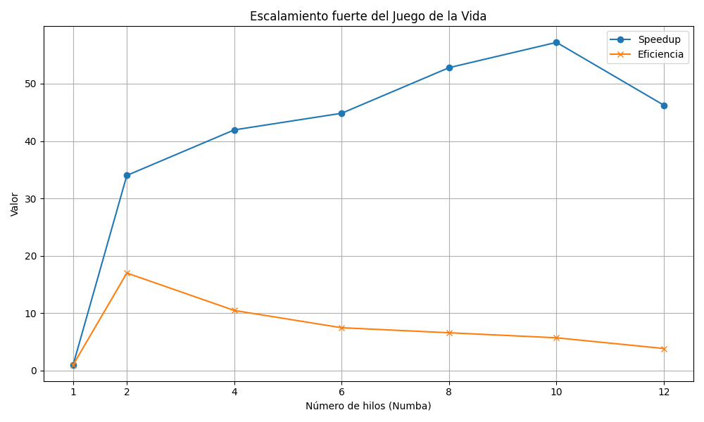
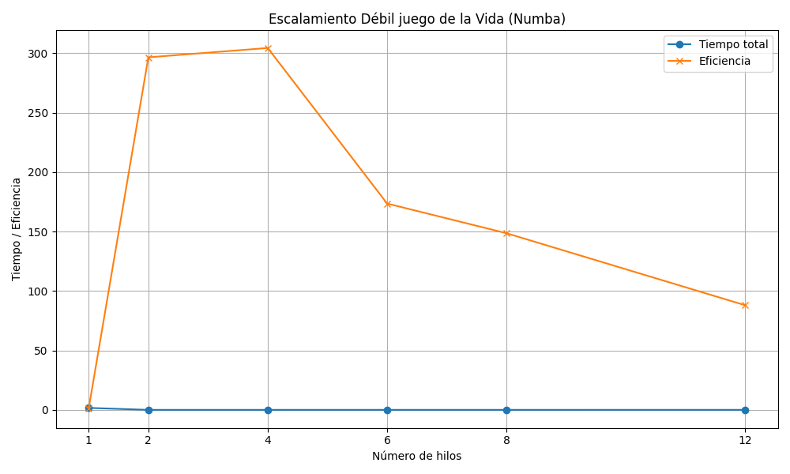

Parte 1 con cProfile.

Las funciones más costosas según los resultados de despúes de haberse calculado de con pstats 
son las siguentes(top 5): 

Llamadas a funciones realizadas: 29073 function calls (27073 primitive calls)

Tiempo de duración total para estas llamadas: 1.383 seconds.

ncalls  tottime  percall  cumtime  percall filename:lineno(function)
        1    0.020    0.020    1.383    1.383 conway.30.py:184(simulacion_representativa)
      100    0.156    0.002    1.353    0.014 conway.30.py:92(step)
      100    0.407    0.004    1.088    0.011 {built-in method builtins.sum}
3801/1801    0.029    0.000    0.715    0.000 {built-in method numpy.core._multiarray_umath.implement_array_function}
      900    0.024    0.000    0.681    0.001 conway.30.py:97(<genexpr>)

En base a esos resultados, la función con más cummulative time es la función step con
**1.383s** y simulación representativa con  **1.353s**, seguidos de otras funciones que ya son parte
de algunas bibliotecas integradas en sus códigos, como numpy y pandas, sin embargo,
son tiempos menores en comparación a la función step y la función de prueba.

Parte 2. _python -m kernprof -l -v conway.30.py_

En este caso, creo que la otra función donde vale la pena intentar probar el profile  aparte de la función step, es en ejecutarSimulación, despúes de colocar el decorador en
estas funciones, estos fueron los resultados:

Line #      Hits         Time  Per Hit   % Time  Line Contents
==============================================================
    93                                               @profile
    94                                               def step(self): #este metodo es necesario para lograr que la configuración se ejecute en modo cuadricula de un kernel 3x3.
    95       200       1395.3      7.0      0.1          kernel = np.array([[1, 1, 1],
    96       100         78.6      0.8      0.0                             [1, 0, 1],
    97       100         68.2      0.7      0.0                             [1, 1, 1]])
    98       100     158464.1   1584.6      8.1          padded = np.pad(self.grid.astype(int), 1, mode='constant', constant_values=0)
    99       200    1680575.8   8402.9     85.6          neighbor_count = sum(np.roll(np.roll(padded, i, 0), j, 1)[1:-1, 1:-1]
   100       100         69.9      0.7      0.0                               for i in (-1, 0, 1) for j in (-1, 0, 1) if (i != 0 or j != 0))
   101
   102                                                   #estas son las reglas en código
   103       100      17246.8    172.5      0.9          new_grid = np.zeros_like(self.grid, dtype=bool)
   104       100      62939.2    629.4      3.2          new_grid[self.grid & ((neighbor_count == 2) | (neighbor_count == 3))] = True
   105       100      38681.7    386.8      2.0          new_grid[~self.grid & (neighbor_count == 3)] = True
   106
   107       100       3311.7     33.1      0.2          self.grid = new_grid
   108       100        220.6      2.2      0.0          self.generation += 1

Total time: 0 s
File: conway.30.py
Function: ejecutarSimulacion at line 110

Line #      Hits         Time  Per Hit   % Time  Line Contents
==============================================================
   110                                               @profile
   111                                               def ejecutarSimulacion(self):
   112                                                   if np.sum(self.grid) == 0:
   113                                                       print("El tablero está vacío,cargue uno bien o cree uno aleatorio.")
   114                                                       return
   115                                                   try:
   116                                                       generaciones = int(input("Cuántas generaciones quiere simular? (default 10): ") or 10)
   117                                                       estado_inicial = self.grid.copy()
   118                                                       generacion_inicial = self.generation
   119
   120                                                       for i in range(generaciones):
   121                                                           self.step()
   122                                                           if i % 10 == 0:
   123                                                               print(f"Generación {self.generation} / Células vivas: {np.sum(self.grid)}")
   124                                                       self.mostrarResultado(estado_inicial, generacion_inicial)
   125                                                   except ValueError:
   126                                                       print("Valor inválido.")

Según estos resultados, es dentro de la función step donde está el principal tiempo de consumo del código, más específicamente en estas 2 líneas: 
padded = np.pad(self.grid.astype(int), 1, mode='constant', constant_values=0) 86,6%

neighbor_count = sum(np.roll(np.roll(padded, i, 0), j, 1)[1:-1, 1:-1] 8,1%

Ya que, estas 2 líneas ocupan el 93,7% del tiempo de ejecución, definitivamente un cuello de botella dentro de la función.
Mientras que la función ejecutarSimulación no tiró resultado alguno, esto podría ser debido a que el tiempo de ejecución
es tan pequeño que no son significativos. Ya que se identificó un cuello de botella en la línea 99, esto se reafirma con que tarda
8,9 segundos para ejecutarse, según la columna 'per hit'. Una posible optimización para esto sea reducir el tamaño de la grilla
pero esto podría variar sobre si es permitido un cambio o si tiene que ser fijo según sea el contexto.
Otra opción podría ser la biblioteca Numba para esta función. Como última opción pero similiar a la primera(en términos de viabilidad) es una mejora
en el equipo donde se vaya a realizar estas pruebas, aumentar el poder computacional de ser posible.

Parte 3 Análisis de escalabilidad.

Para esta parte que hay que correr la función step pero pararelizado, en este caso será hecho con Numba. Según las instrucciones,
se tiene que realizar una función step pararelizada, por ende, la función step fuera de cla se tendrá de uso como máximo 12 hilos, ya que es la máxima cantidad de mi computadora.
Una vez ejecutado la función step con numba, dió estos resultados(nota: tuve unos problemas para hacer la matriz de
la función step original):

1 hilos, tiempo total: 1.5901 segundos

2 hilos, tiempo total: 0.0468 segundos

4 hilos, tiempo total: 0.0379 segundos

6 hilos, tiempo total: 0.0355 segundos

8 hilos, tiempo total: 0.0301 segundos

10 hilos, tiempo total: 0.0278 segundos

12 hilos, tiempo total: 0.0344 segundos

En este gráfico se puede ver que la eficiencia a partir del 2do hilo fue disminuyendo, lo cual podría ser
por un exceso de carga de trabajo en los hilos, mientras que el speedup fue aumentando hasta los 10 hilos,
lo cual significa que no siempre el uso de la mayor cantidad de hilos posibles es lo mejor porque para el 
último hilo disminuyó su speedup, igual se puede observar en los resultados del timepo total por hilo presentados antes.

Para el escalamiento débil, lo hice en un py aparte para menos complicaciones, llamado escala debil.py
Estos fueron los resultados:

Hilos: 1, Tamaño grilla: 100x100, Tiempo total: 1.6724 s

Hilos: 2, Tamaño grilla: 141x141, Tiempo total: 0.0056 s

Hilos: 4, Tamaño grilla: 200x200, Tiempo total: 0.0055 s

Hilos: 6, Tamaño grilla: 244x244, Tiempo total: 0.0096 s

Hilos: 8, Tamaño grilla: 282x282, Tiempo total: 0.0113 s

Hilos: 12, Tamaño grilla: 346x346, Tiempo total: 0.0190 s

Estos tamaños de grilla salen de ser calculados para que la cantidad total de celdas que aumente con los hilos, 
pero manteniendo constante la carga por hilo, en la vaariable tamanio. En el gráfico se puede observar como el tiempo
se mantuvo casi constante en 0, a excepción del hilo 1 que se aprecia un ligero aumento con respecto al resto.
Entonces, según el gráfico, la constancia del tiempo parecía variar de acuerdo a los hilos y tamaño de grilla pero
casi siempre manteniendose debajo a 1 segundo, a excepción del primero que esto quizás se deba a que Numba requiera 
más tiempo para realizar la primera ejecución.

Conclusiones.
La pararelización sí afecta de un modo u otro, según sea el aumento de hilos mayor será el timepo disminuido,
sin embargo, la eficiencia tiende a disminuir conforme se agregan más hilos debido a la posible sobrecarga de 
paralelización, lo cual no estoy seguro de ser por el código del juego o por el poder computacional de mi computadora.